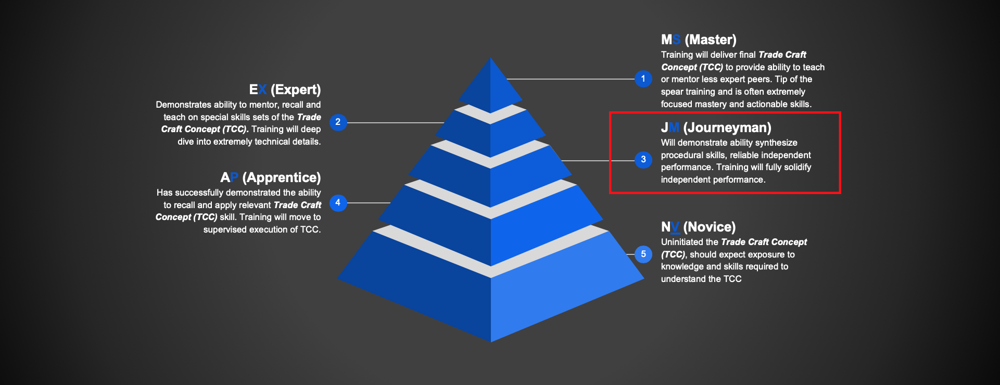
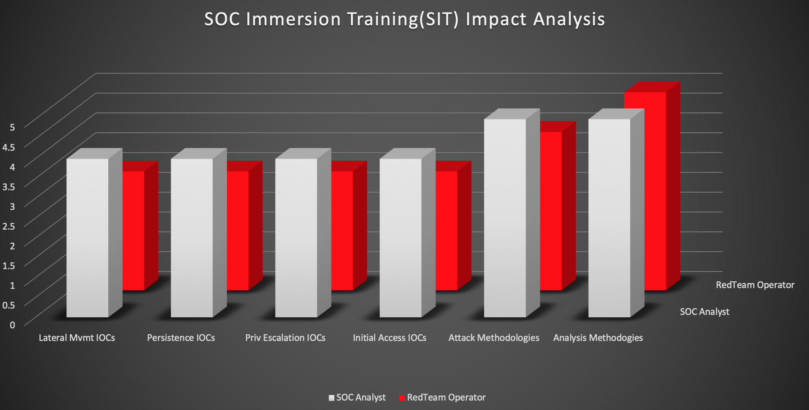
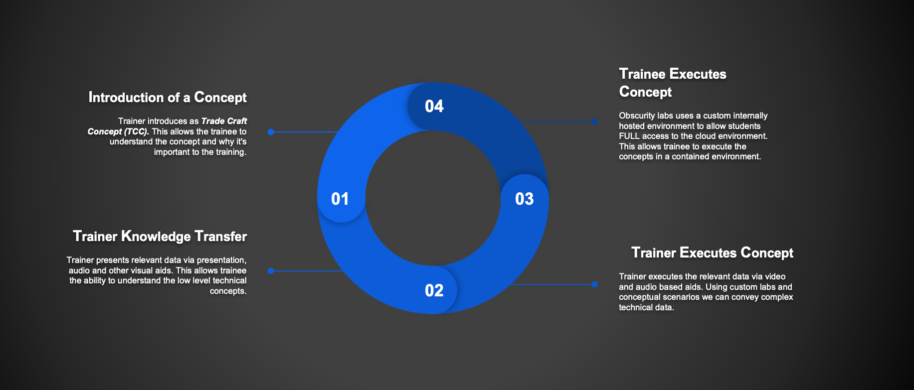

# Course Theory

## Instruction Level

### NV - Novice

Uninitiated the Trade Craft Concept \(TCC\), should expect exposure to knowledge and skills required to understand the TCC

### AP - Apprentice 

Has successfully demonstrated the ability to recall and apply relevant Trade Craft Concept \(TCC\) skill. Training will move to supervised execution of TCC.

### _**JM - Journeyman**_

Will demonstrate ability synthesize procedural skills, reliable independent performance. Training will fully solidify independent performance.

### EX - Expert

Demonstrates ability to mentor, recall and teach on special skills sets of the Trade Craft Concept \(TCC\). Training will deep dive into extremely technical details. 

### MS - Master

Training will deliver final Trade Craft Concept \(TCC\) to provide ability to teach or mentor less expert peers. Tip of the spear training and is often extremely focused mastery and actionable skills.

## SOC Immersion Training \(SIT\) Impact Analysis

  

## Instruction Process 

### Trainee Executes Concept

Obscurity labs uses a custom internally hosted environment to allow students FULL access to the cloud environment. This allows trainee to execute the concepts in a contained environment.

### Trainer Executes Concept 

Trainer executes the relevant data via video and audio based aids. Using custom labs and conceptual scenarios we can convey complex technical data.

### Trainer Knowledge Transfer

Trainer presents relevant data via presentation, audio and other visual aids. This allows trainee the ability to understand the low level technical concepts.

### Introduction of a Concept

Trainer introduces as Trade Craft Concept \(TCC\). This allows the trainee to understand the concept and why it's important to the training.   

